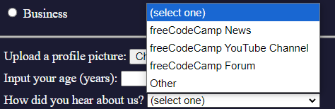

h1 ..h6

img

<>
img src

figure

figure figvaption

form
form action
input 

input type

<input type="" name="type of data">
    help specifies the name of an element, 

<input type="" name="" placeholder="example of contentent">
    55-555-55, francisco, www....
    helpful when there is multiple inputs

<input ... required> //so user has to input data

<button></button> // creates a button
<button>button text</button>
if the button is a form, it will send the data to the action url

inline element,  . . .
blocl elements 
.
.
.

<button type="type of button">Submit</button>
  ...submit, ... to be more specific

radio button, select only one option

<label><input type="radio"> item </label>
    label -> help asociete the the text with the input

<tag id="an id"> // must be unique, help identify element

<input type="" name="type of data">
   in an input element the name is used to reference when data is submitted

<input... value="...">
   when submitting an input in a form the value is what is being submited

<fieldset></fieldset>
  groups input and label elements in a form

<fieldset>
  <legend>description</legend> //little description for the fieldset content
</fieldset>

<input type="checkbox">
    square type, muptiple answer

associete text and the input
<label><input type="radio"> item</label>
or
<input id="my_id" type="radio"> <label for="my_id">item</label>
just nesting the test in the labeñ and add a for with the same vcalue as the input's id

<input ... checked>
  automatically check a radio or checkbox 

<footer>
</footer>
  usually contains information about author or the documents

<html>
  <head> //metadata
  </head>

  <body>
    <main>
    </main>
  </body>

</html>

  <head>
    <title>title in the tab</title>
  </head>

<!DOCTYPE html> // tells browser is an html5 

<html lan="en">//specigies language

<head>
  <meta charset="utf-8"> // encoding type

-----------------------------------------------
<head>
   //add styles to an element
</head>

//sintax
element{
  property: value;
}
center an h1
h1{
  text-align:center // to center a text in its element
}

//if multiple elements share the same styling
selector1, selectro2{
  property:value;
}
h1, h2, p{
  text-align:center;
}

// all the styles could go in to the head elemnt in a style elemntr

//but it is better to create a "styles.css" file
//to link the css file to the html file

<head>
  <link rel="stylesheet" href="styles.css">
</head>

//to make sure the styling looks similar on diferent devices
<head>
  <meata name="viewport" content="width=devide-with initial-scale=1.0" />
</head>

// to help dseparate celements for design porpuses we can use a div 

.
.

// to represent content, blog entry, a post,...
multiple element that have related information
<article>
</article>

// you can add a divider a line 

 
 ************************************************************
<!-- Learn CSS Colors by Building a Set of Colored Markers -->

------------------------------------------------------------

// to specify how to dend datain a form use the "method" attribute
and use
POST - will be sent via a post request as data in the request bosy
GET - will be sent via a get reques as URL parameters

// with password type input
ypou can specify a minimum charlength
<input type="password" minlength=8>

ot to add a regex attern to match
<input type="password" pattern="[a-z0-5]{8,}"
The above is a regular expression which matches eight or more lowercase letters or the digits 0 to 5.

for number tyoe inputs you can add min a mx number accepteed value
<input type="number" min=2 max=999 />

// to add dropdown menu
<select>
  <option></option>
</select>
          <select>
            <option>(select one)</option>
            <option>freeCodeCamp News</option>
            <option>freeCodeCamp YouTube Channel</option>
            <option>freeCodeCamp Forum</option>
            <option>Other</option>
          </select>

// submiting an option, like the example above will not send useful information, adding a value is the norm
          <select>
            <option value="">(select one)</option>
            <option value="1">freeCodeCamp News</option>
            <option value="2">freeCodeCamp YouTube Channel</option>
            <option value="3">freeCodeCamp Forum</option>
            <option value="4">Other</option>
          </select>

// the <textarea></textarea> is another type of input text, but this one shows a buigger text box for multiple line texts

<textarea></textarea>
to give it an iniat custos size
<textarea rows=12 cols=22></textarea>

