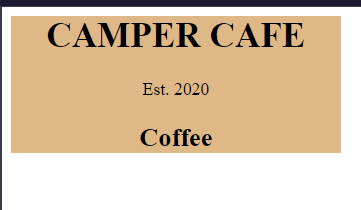

// css- to change colors
selector{
  background-color: a_color;
}

//css to add styles to an element by ots id we use #

</id>
// in the cssfile
#menu{
  property:value;
}

//css- to make sure an element uses a specific width
selector{
  width: 123px;
}

//css - to make a commnent
/* asas */

// css example
#menu {
  width: 300px;
  background-color: burlywood;
}
the menu element has a set width and chaging its background color would chage just its width

// instead of px we can use %, in case the size changes the element will remain with its porcentage

selector{
  width:80%
}

//css to center elements we can use margin:auto 
This will center left and rigt
the margin is the space outside around an element
selector{
  margin-rigth:auto;
  margin-left:auto
}

//to taget element by class name
.class-name{
  property:value;

}

// css - to add a background image
property{
  background-image: url(https://url.jpg)
}

// to move text to the left
selector{
  text-align:left;
}

to target nested elements
<parent>
<child>
</parent>
this will taget the child elemento inside the parent
parent child{
}
article p{
  ...
}
<article>

</article>

// padding
is the space of the content and the inside of the element borders

selector{
  padding: 20px
}

// margin and padding
usiing just padding or margin will target all 4 sides

selector{
   margin:20px 
}
or
selector{
  margin-top:20px;
  margin-bottom:20px
  margin-left:20px;
  margin-rigth: 20px
}

// max-widht will give a max value, to avoid probles with bigger monitors
selector{
  max-width: 500px
}

// to change the font
selector{
  font-family: font;
}

// in case a font is not font you can add an alternative
selector{
  font-family: font, font2, font3...
}

//to chage the style, 
selector{
  font-style: italic;

}

// change the height of an element
selector{
  heigth:10px;
}

// to chanhe the ccolor of the borders
selector{
  border-color:color;
}

// anchors <a> have a psudo selector to target styles after vissited
a:visited{
  property:value;
}

//anchors <a> have a pseudo selector when hovering
a:hover{
  property:value;
}

//anchors <a> have a pseudo selector when clicking
a:active{
  property:value
}