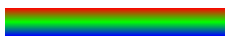

// css- to change colors
selector{
  background-color: a_color;
}

//css to add styles to an element by ots id we use #

</id>
// in the cssfile
#menu{
  property:value;
}

//css- to make sure an element uses a specific width
selector{
  width: 123px;
}

//css - to make a commnent
/* asas */

// css example
#menu {
  width: 300px;
  background-color: burlywood;
}
the menu element has a set width and chaging its background color would chage just its width

// instead of px we can use %, in case the size changes the element will remain with its porcentage

selector{
  width:80%
}

//css to center elements we can use margin:auto 
This will center left and rigt
the margin is the space outside around an element
selector{
  margin-rigth:auto;
  margin-left:auto
}

//to taget element by class name
.class-name{
  property:value;

}

// css - to add a background image
property{
  background-image: url(https://url.jpg)
}

// to move text to the left
selector{
  text-align:left;
}

to target nested elements
<parent>
<child>
</parent>
this will taget the child elemento inside the parent
parent child{
}
article p{
  ...
}
<article>

</article>

// padding
is the space of the content and the inside of the element borders

selector{
  padding: 20px
}

// margin and padding
usiing just padding or margin will target all 4 sides

selector{
   margin:20px 
}
or
selector{
  margin-top:20px;
  margin-bottom:20px
  margin-left:20px;
  margin-rigth: 20px
}

// max-widht will give a max value, to avoid probles with bigger monitors
selector{
  max-width: 500px
}

// to change the font
selector{
  font-family: font;
}

// in case a font is not font you can add an alternative
selector{
  font-family: font, font2, font3...
}

//to chage the style, 
selector{
  font-style: italic;

}

// change the height of an element
selector{
  heigth:10px;
}

// to chanhe the ccolor of the borders
selector{
  border-color:color;
}

// anchors <a> have a psudo selector to target styles after vissited
a:visited{
  property:value;
}

//anchors <a> have a pseudo selector when hovering
a:hover{
  property:value;
}

//anchors <a> have a pseudo selector when clicking
a:active{
  property:value
}

-----
<!-- Learn CSS Colors by Building a Set of Colored Markers -->

// colors
You can add color by its name or by the rgb ccode
each number is the  color value red, gree, blue
selector{
  color: rgb(0, 0, 0)
}

//You can us hex values, each value pair is the representation of RGB in hex value similar to rgb()
selector{
  color: #123456
}

// or hsl, hue, saturation, light, hue from 0-360, saturation and light, 0% to 100%
selector{
  color: hsl(360, 100%, 1005)
}

// insted of a flat color you can set a gradient, of color
to go from one color to another
linear-gradient(gradientDirection, color1, color2, color3)
gradientDirection - a line in degrees 90deg = ------->
color - a coloor, in whivhever format you want

// color stops in linear-gradient
linear-gradient(1deg, red 50%, blue, 10px)
red 50% -> will stop the colo at 50% of the element
blue 10px -> will stop the color at 10 px of the element

background: linear-gradient(180deg, rgb(255, 0, 0) 0%, rgb(0, 255, 0) 50%, rgb(0, 0, 255) 100%);

it is important to notice that linear-gradient
will work with the property
background:

// opacity, 
how transparent or  opaque a color is
selector{
  a color;
  opacity: 1;
}
a value from 0 to 1
0 transparent
1 normal

// alpha
youcan use rgba() to set the transparency
it is the convination of rgb() and opacity
selector(
  background-color: rgba(0, 0, 0, 50%)
)
adding an extra value for the opacity
0.5 == 50%

// to change the border width (left)
selector{
  border-left-width:10px;
}

//to change the border style (left)
selector{
  border-left-style: solid
}
there are different styles

// to chage the color of the border (left)
selector{
  border-left-color: green;
}

// instead of setting the values one by one you can
selector{
  border-left: width style color;
}

and just add the values
border-left: 10px solid green;

// To add a shadow, you can use
selector{
  box-shadow: offsetX offsetY  color;
}
offsetX vertical position
offsetY horizontal position
color;

box-shadow:5px 5px red;

 box-shadow: -5px -5px red;

//You can add a blur value
box-shadow: offsetX offsetY blurRadius color;
the higher the value the more blurry

// youcan spread the shadow
box-shadow: offsetX offsetY blurRadius spreadRadius color;

// you can add alpha value to hex colors
without
#FFFFFF
with
#FFFFFFAA
two extra values