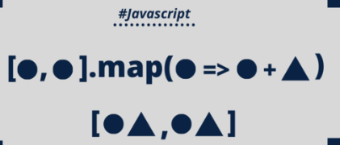
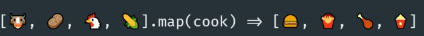
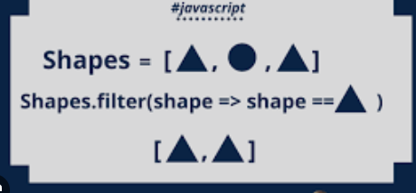
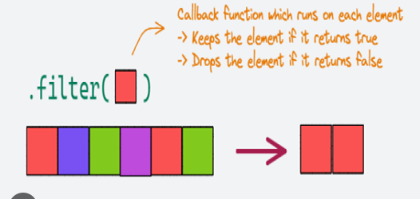

### metods with array:

array[number]  
returns the value in the number index  
array start from 0
you can use : array[array.lenght -1]
to acces the last element

array.lenght
Returns the size of the array

array.push(value)
adds a value at the end of the array
return the size of the array


array.pop()
removes the las element of an array
return the element removed


-------------------------------------
Using let lets you change the value of a variable

conts
is for constants
you can change their values and you have to initialize them
```
cont my_const = 12;  ok
cons my_const;    -> not ok
```

you can reassign their values
```js
cont my_const = 2;
my_const = 3;   -> not ok
```

---
### LOOPS

to repeat task until a condition is met we use LOOPS

####for loop 
```javascript
for (iterator; condition; iteration){
    logic
}
```
iterator = a variable that controls how the loops iterate
usually `let i = 0`
the iteration start at `0`

```javascript
for (let i = 0; condition; iteration){
    logic
}
```

condition - tells the loop how many times will iterate
it will work while the condition is true
if count is less than 4, it will continue looping

```javascript
for (let i = 0; 1 < 4; iteration){
    logic
}
```

iteration - will the what todo in each iteration loop
usually adding a value.
this will add 1 to `i` in each iteration until i in not less than count anymore
```javascript
for (let i = 0; 1 < 4; i = i +1){
    logic
}
```

example

```javascript
let count = 8
for (let i = 0; i < count; i = i + 1) {
  console.log(i)
}
```
this will print
```javascript
0
1
2
3
4
5
6
7

```
---
#### for ... of loop

this will  loop trough each value in the iterable and assign to `value`,  
```javascript
for const value of iterable{

}
```
example
```javascript
let rows  = [1, 2, 3, 4, 5 , 6]
for (const row of rows){
    console.log(row)
}
```
``javascript
1
2
3
4
5
6

```

---

### Concatenation

adding strings to another strings
```javascript
let saludo = "hello"
saludo = saludo + "world"

console.log(saludo)
> hello world
```

it exist special characters to
example
```javascript
"\n"
> counts as a new line
```
```javascript
let saludo = "hello"
saludo = saludo + "\n" + "world"

console.log(saludo)
> hello 
> world
```

## String methods

`.repeat(value)`
lets you repat value times a string
```javascript
console.log("a".repeat(2))
> aa

let name= "paco"
console.log(name.repeat(3))
> pacopacopaco
```

---
### functions

funtions are block of code for repetitive tasks

```javascript
function name(parameter){

}
```
name -> nmae of your function
parameter -> variable passed to you function, that you can use inside it

To use the function you need to call it
```javascript
function test() {

}

test(); // calling your test function

```

Examples

functions return values
those values can be assigned to a variable
then log the returned value
```javascript
function padRow() {

}


const call = padRow(); 
console.log(call);
> undefined
```

it returns `undefined` because there is not return in the function

```javascript
function demo() {
  return "Functions are cool!";
}

// this will return a string now
```

```javascript
function padRow() {
  return "Hello!"

}

const call = padRow();
console.log(call);
> Hello!
```

---
TO passs a variable to the funtion we use parameters

```javascript
function demo(name) {

}

// name is a variable we can use inside the funciton
```

Now instead of returning a fixed value "hello!"
we can return the parameter value, which we can change

```javascript
function padRow(name) {
  return name;
}


```

Examples

```javascript
function demo(name) {
  return name;
}
demo("Naomi")

console.lo

// here we pass a value to name inside the function call 
```

```javascript
function padRow(name) {
  return name;
}

const call = padRow("paco");

console.log(call);
> paco
```

example:
Declare a sum variable and assign it the value of calling your addTwoNumbers function with 5 and 10 as the arguments. Log the sum variable to the console.
```javascript
function addTwoNumbers(a, b){
  return a + b
}

let sum = addTwoNumbers(5, 10)
console.log(sum)

```

----
----
## Scope

A variable can only be used in the scope it was declared

```javascript
// this is the global scope
let a;

{
    // a can be used here

    let b;

}
// b can not be used here
//because b is a separe block of code {}
a block of code could be a funciton a loop

```

```javascript
{
    let a;
    // I can use a here
}

{
    // I cant use a here
}
```

```javascript
function padRow(name) {
  const test = "Testing";
  return character + name;
}

console.log(test)
> ReferenceError: test is not defined
// test is declared in a local scope the funtion scope
// and can only be accesed inside that funciont
```

If you want to use the variable out side its scope you can return the value
```javascript

function padRow(name) {
  const test = "Testing";  
  return test
}
```

---
---
Remeber that the return in a function stops the function
so, all the code after the return will not run

```javascript
function padRow(name) {
  const test = "Testing";
  
  return test;
  console.log("This doesn't works!")
  
}
```

```javascript
function padRow(name) {
  const test = "Testing";
  console.log("This works!")
  return test;
  
  
}
```

It is possible to pass full expression as an argument

// this 2 function call are the same
```javascript
test(2 * 3 + 1);

test(7);
```

---
---

there are operators for commont uses

this 2 expresions are the same.
all add 1 to test
```javascript
test = test + 1;
test += 1;
test ++
```

The mase is posible for subtraction

```javascript
i = i -1
i -= 1
i--
```
---
---
### Comments

To add acomment we use //
or /* ... */

```javascript
// I am a single line Comments
// I dont run or execute

/*
I am a multi line
Comments
everythin inside is a
comment

*/
```

---
---
## if statement

AN if statement lets you run a block of code only when a condition is true
```javascript
if (condition) {
  logic
}

if(true){
  console.log("Condition is true")
}
> Condition is true


if (false) {
  console.log("Condition is true");
}
// now the condition is not true so the block will not execute
```


```javascript
if ("false") {
  console.log("Condition is true");
}
> Condition is true
```
The text has appeared again! This is because "false" is a string, which when evaluated to a boolean becomes true. This means "false" is a truthy value

falsy values:
false, 0, "", null, undefined, and NaN.

everything else is truthy when evaluated to a boolean

---
# if else

if else statement lets you have multiple condition

```javascript
if (condition1) {
  // code to run if condition1 is true
} else if (condition2) {
  // code to run if condition2 is true
} else if (condition3) {
  // code to run if condition3 is true
} 
```

if the condition is false it will go to the next condition until one of them is true

```javascript
if ("") {
  console.log("Condition is true");
} else if ( 5 < 10){
   console.log("5 is less than 10")
}
>5 is less than 10
```

you can add an else, that will execute the nothing is true

```javascript
if (condition) {
  // this code will run if condition is true
} else if (condition2) {
  // this code will run if the first condition is false
} else {
  // this code will run 
  // if the first and second conditions are false
}
```

notice that all conditions are false

```javascript
if ("") {
  console.log("Condition is true");
} else if (5 > 10) {
  console.log("5 is less than 10");
}else{
  console.log("This is the else block")
```

---
---
## While loop

A while loop will run until the condition is no longer true

```javascript
while (condition) {
  logic;
}
```

---
---
array methods .unshift() .shift()

array.unshift()
adds a value to the begining of an array and it returns 
the new lenght

```javascript
const countDown = [2, 1, 0]; //initial values
const newLength = countDown.unshift(3); // add 3 at the beggining
console.log(countDown); // [3, 2, 1, 0] 
console.log(newLength); // 4
```

array.shift()
removes the fist element of an array
and returns the extracted value

```javascript
const numbers = [1, 2, 3];
numbers.shift();
console.log(numbers) // [2, 3]
```


---
---
## Add javascript to you html

```html

<body>

  <script>
    // code here
    console.log("Hello World");
  </script>
</body>
```

Like css you can add a separete file for your js code

```html
<script srcc="./script.js">
</script>
```
now you can write your js code in a separe file just la with css

---
---
# access the html dcument trough js

the querySelector("");

finds the first element that match the css like querySelector

```javascript
// to match the fist h1 element
let h1 = document.querySelector("h1"); 

// to match a class
let h1 = document.querySelector(".my-Class"); 

// to match an id 
let h1 = document.querySelector("#my-id"); 
```

---
---
# javascript  properties
YOu can accsess elements properties
to determine what happens when you iterct with the element

## button properties onclick
here we call a button and save it in a button connstant
```javascript
const button1 = document.querySelector('#button1');

// to access the properties we can use dot notation
button1.onclick = myfunction;
```
we call the .onclick property from the button
and when the button is clicked we call `myfunction`
wich is a function we can create

notice that `myfunction` doeen't have `()`


## text properties
we can change the text from elements with 
`innerText`

```javascript
//html
<p id="info">Demo content</p> 
// we have p element

// we call the #info element
const info = document.querySelector("#info"); 

//and use innerText to change the text
info.innerText = "Hello World"; 

// from Demo content to Hello World


```
example :
```javascript

const button1 = document.querySelector("#button1")

button1.onclick = changeText
function changeText() {
  button1.innerText = "I am the new text"
}

// we sabe in button1 a button with the id button1

//ad onclick and reference changeText when the button is clicked
// inside changeText we change the taxt from the same button
```

---
---
# scape character \

```javascript 
//this tring will print like this
"I am TEXT"
> I am TEXT
```
but what if want to print it like this 
> I am "TEXT"

TEXT in quotes

this will trow an error becausei am closing the quotes
```javascript
"I am "TEXT""

```

to do this we use scape the TEXT quotes with \
```javascript
"I am \"TEXT\""

> I am "TEXT"

```


---
---
# Objects
an object lets you save values in akey-value pair


{
  key: value
}

```javascript
// a cat constant with an empty object
const cat = {};
console.log(cat)
> {}
```

Here is an example of an object with data
```javascript
const obj = {
  name: "Quincy Larson",
  "Space Name": "Kirk",
};
```
is the key has a space use double quotes

```javascript
const cat = {
  name: "Whiskers",
  "Number of legs": 4
};
console.log(cat)
> { name: 'Whiskers', 'Number of legs': 4 }
```

to access the values we can use dot notation or bracket
. []
```javascript
const cat = {
  name: "Whiskers",
  "Number of legs": 4
};

console.log(cat.name)
> Whiskers

console.log(cat["Number of legs"]);
> 4
```
if the key has a space you need to use brackets `[]`

---
---
# Acces styling in javascript

by accessing the style properti we can modigy the styling like in css

```css
p{
  display:none;
}
```

```javascript
const paragraph = document.querySelector('p');
paragraph.style.display = 'block';
```
in the css code p is hidden button with js we can add a functionality to show the element

---
---
# random numbers
the js math object has different mathematical methos 
.random() is one of the 
Math.random()
return a number between 0 and 1
with this we can make random number

```javascript
random numbers
Math.floor(Math.random() * 5) + 1; // from 1 to 5
Math.floor(Math.random() * 10) + 1; // from 1 to 10
```
Math.floor() rond the number down

---
---
# add quoes to strings

instead of \ to add quotes
"hi my \"love\"."
we can use single quotes to diferentiate from double

'hi my "love".'

both will print the same
hi my "love".

---
---
# change the content of an element with js
html code:

```html

<p id="demo">This is a paragraph.</p>

```
js code:
```javascript

document.querySelector("#demo").innerHTML = "Hello, innerHTML!";

```
imaginge youare passing tags to to innerHTML and innerText
`.innerHTML would show = hi i am <strong>bold</strong>`

`.innerText  would show = hi i am bold `
with bold bolded but 

The difference between innerText and innerHTML is that innerText will not render HTML elements, but will display the tags and content as raw text.

---
---
# ternaty operation
Is similar to an if-else statement but in one line
```javascript
condition ? if-true : if-fasle
```
example:
```javascript
// if-else statement
if (score > 0) {
  return score
} else {
  return default_score
}

// ternary operator
return score > 0 ? score : default_score
```

---
---
# logic operators
or operation
```javascript
||

true || true 
true or true
true if only one statement is true
```

if operator
```javascript
&&

true && true
true and true

return true only if both statements are true
```

---
---
# add a new line

\n = a new line

```javascript
console.log("line 1 \n line 2")
>line 1
>line 2
```

---
---
# .includes methods

to check if an array contains an element we can use
array.includes(element)

example:
```javascript
const numbersArray = [1, 2, 3, 4, 5]
const number = 3
// this will checj if number is in numbersArray 
if (numbersArray.includes(number)) {
  console.log("The number is in the array.")
}
```

---
---
# access an html element by id
similar to .querySelector()

you can access an element by its id
document.getElementById("...")

example:
```javascript
<h1 id="title">Main title</h1>


const mainTitleElement = document.getElementById('title');
```
In this case you just need the name of the id

---
---
# regex
regular expresions regex
are used to match patterns

example:
```javascript
const regex = /hello/;
```
this will will match the string literal "hello"

```javascript
const regex = /\+-/; // to match + and - characters
```

### shorthand characters
let you match specific characters withput having to wrte them

example:
```javascript
 const regex = /\s/
```
\s -> matches whitespace

```javascript
 regex = /\+-\s/; // mconstatches "+" "-" " "
```

### character class []

```javascript

regex = /\+-\s/;
// this will match "+- "
// but won´t "+ - "
//it will match the specific string
```

to match each character individually we use character classes [...]
```javascript
const regex = /[+-\s]/;
```

### regex flags 
flags let you add more matching behaviour
the g flag -> is the global flag, it will continue looking after it has fountd a match

```javascript
const helloRegex = /hello/g;
```
it goes after the closing /

the i flag -> for case insensitive

```javascript
/Hello/i
// will match hEllo, heLLo, etc
// the casing wont matter
```
---
---
# .replace() method

the string.replace() methode replaces characters

string.replace(character to replac, the string that will replace)
the first argument accepts regex or string 

example:
```javascript
"hello".replace(/l/g, "1");
> he11o
```
this will replace all `l` with `1`

example:
```javascript
  const regex = /[+-\s]/g;
  return str.replace(regex, "");

```

# regex
```javascript
[0-9] // will match any number from 0 to 9
1
```
the + modifier allows you to matchpatterns that occur more than once

```javascript
[0-9]+ // will match any number from 0 to 9, multipletimes
122112
```
the shorthand \d will match any digit
```javascript
\d
[0-9]

// both are the same
```

---
---
# method match
the .match method will return a matched string
str.match(string to match)
```javascript
const str = 'example string';
const regex = /example/;
const result = str.match(regex); // Returns ['example']
```
if g global is added-> it will return all the matches if not just the firs one

example:
```javascript
 const regex = /\d+e\d+/i;
 str="1e3"
  str.match(regex);
// [ '1e3', index: 0, input: '1e3', groups: undefined ]
```
Here is a complete breakdown of that information:

"1e3" is the matched value against the /\d+e\d+/i regex.
index: 0 is the index of the matched value in the string.
input: '1e3' is the original string that was matched.
groups: undefined are the matched groups, which are not used in this case. You will learn more about groups in a later project.

If there is no match it will return `null`


---
---
# get an element value

to get the value from inout element we ca use .value

example:
```javascript
const entryDropdown = document.getElementById('entry-dropdown');
console.log(
  entryDropdown.value
)
// will return the selected value in the dropdown
```
---
---
# template literals

instead of concatenating like this
```javascript
let name = "paco"

console.log(
  "hello " + name
)
```

we can use template literals
`` using backticks

```javascript
let name = "paco"

console.log(
  `hello ${name}`
)
```
we put the variable name directly ${}


---
---
#  querySelectorAll()

the  querySelectorAll() method returns in a array all the elements that matches the selector

```javascript
//To obtain a NodeList of all of the <p> elements in the document:


const matches = document.querySelectorAll("p");
```

---
---
# .addEventListener("click",...)

the addEventListener method with the click event is similar to onclick()

addEventListener(event-to-listen, callbackFunction)

```javascript

<button class="btn">Print name</button>
const button = document.querySelector('.btn');

function printName() {
  console.log("Jessica");
}

button.addEventListener('click', printName);
button.onclick = printName
```

both do the same, but they do have their differences

---
---

# insertAdjacentHTML

insertAdjacentHTML is similar to innerHTML but
innerHTML -> dont preserve the existing content all content reset with each element added so if you have added input and put some values they will clear

.insertAdjacentHTML() -> lets you presrver the data

.insertAdjacentHTML(position of the inserted element,html to be inserted );

the posisions are predetermined

```javascript
targetInputContainer.insertAdjacentHTML("beforeend",HTMLString );
```

---
---
# Number() string to number
to convert an string to a number we the function Number()
if the strinf cant be converted it will return NaN
```javascript
Number("10") // returns the number 10
Number("abc")// return NaN
```

---
---
# global error flag 
when using onclick on buttons in a form, 
it will use submit behavior, thus, will try to reload the page to prevent this we can use
preventDefault(e)
```javascript

function myFunc(e) {
  preventDefault(e)
}

button.addEventListener("click, myFunc )
```
adding preventDefault(e) to the passed function will stop the default behavior

---
---
# to lowe case 

the method
string.toLowerCase()

will return the string in lower case
```javascript
const firstName = 'JESSICA';
console.log(firstName.toLowerCase()); // Output: jessica
```

---
---

# Math.abs()

an absolute number is the positive value of a number

```javascript
const num = -5;
Math.abs(num); // 5
```

---
---
# remove class from element

html element have the property .remove()
which lets you remove a aclass from an element.

```javascript
const paragraphElement = document.getElementById('paragraph');
paragraphElement.classList.remove('hide');
```
the class hide is removed from the paragraphElement element

---
---
# NodeList to array
document.querySelectorAll return a node list, but sometimes wi need it to be an array
Array.from() converts it to an array

```javascript
<ul>
  <li>List 1</li>
  <li>List 2</li>
  <li>List 3</li>
</ul>


const listItemsArray = Array.from(document.querySelectorAll('li'));

console.log(listItemsArray); //Output: (3) [li, li, li]
```

---
---
# add a class to an element

to do the opposite of classList.hide()
which is add a class to an element we have
classList.add()

```javascript
output.classList.add('hide');
```

---
---

# srpead operator ...

the spread operator allows you to copy array element or bobine them. without affecting the original array
```javascript
const arr1 = [1, 2, 3]
const arr2 = [4, 5, 6]
const combinedArr = [...arr1, ..arr2];
console.log(combinedArr)
> [1, 2, 3, 4, 5, 6]
```

---
---

# arrow function
arrow function are anonymous and ashorter way to make a function

```javascript
() => {}

// to add a name assign it to a variable

const myFunc = () => {
 console.log("hi") 
}

myFunc();
```
YOu can pass parameters
```javascript


const myFunc = (name) => {
 console.log("hi " + name) 
}

// if you have only one parameter you can ommit the parentesis

const myFunc = name => {
 console.log("hi " + name) 
}

myfunc("paco")

```
You can return values
```javascript


const myFunc = (a, b) => {
 return a + b;
}

myfunc(123, 654)

```
if your function only return a single value and do nothing else you can omit the eturn keyword and {}

```javascript
const myFunc = (a, b) =>  a + b;

myfunc(123, 654)
```

---
---
# map() method
the map method iterate through an array and returns a new array, 

```javascript
const numbers = [1, 2, 3];

const doubledNumbers = numbers.map((number) => number * 2); 
// doubledNumbers will be [2, 4, 6]
```
map iterate each value of numbers does, what the arrow function says and returns the value.





---
---

# join() method

if you have an array, and want to join all the values into a single string you can use
array.join()

join accepts a separator as an argument,

```javascript
const exampleArr = ["This", "is", "a", "sentence"];
const sentence = exampleArr.join(" "); // Separator takes a space character
console.log(sentence); // Output: "This is a sentence"

const exampleArr = ["This", "is", "a", "sentence"];
const sentence = exampleArr.join("-"); // 
console.log(sentence); // Output: "This-is-a-sentence"
```

---
---

# optional chaining ?.

if you try to access an inexisting property in an object it will trow an error

```javascript
const adventurer = {
  name: 'Alice',
  cat: {
    name: 'Dinah',
  },
};

//cat.name exists and returns the value
const dogName = adventurer.cat.name;
console.log(dogName);
// Expected output: Dinah


//dog.name dont exists trows an error
const dogName = adventurer.dog.name;
console.log(dogName);
// Expected output: Error: Cannot read properties of undefined (reading 'name')

// now using ?. instead of an error return unespected
const dogName = adventurer.dog?.name;
console.log(dogName)
// Expected output: undefined
```

---
---

# sort() metod

the sort() method allows you to sort elements in an array
it conversts them to strings and dort them

```javascript
const names = ["Tom", "Jessica", "Quincy", "Naomi"];
names.sort() // ["Jessica", "Naomi", "Quincy", "Tom"]
```

One way to randomize an array using sort(), arrow function and and Math.random is
```javascript
const names = ["Tom", "Jessica", "Quincy", "Naomi"];
names.sort(() => Math.random() - 0.5);
```

---
---
# find() method

Thhe find methos returns the first element that fullfils the condition in the callvack function

In the example below, the find() method is used to find the first number greater than 25:

```javascript
const numbers = [10, 20, 30, 40, 50];

// Find the first number greater than 25
const foundNumber = numbers.find((number) => number > 25);
console.log(foundNumber); // Output: 30
```

---
---
# indexof()

to get the index of an element inside an arraywe have the 
indexOf() method array.indexOf(value to find)

```javascript
const animals = ["dog", "cat", "horse"];
animals.indexOf("dog") // 0

animals.indexOf("penguin") // -1
```
if the element is not in the array, it will return -1

---
---
# forEach()

the array.forEach() method iterates in each element of the array an does what the arrow funtion tells it, it does not return a new array

```javascript
const number = [1, 2, 3, 4, 5]
numbers.forEach((number) => {
  console.log(number) // 1, 2, 3, 4, 5
})
```

---
---
# removeAttribute() and setAttribute()

the removeAttribute() method removes an attribute from an element

```javascript
document.getElementById("div1").removeAttribute("disabled");
```

If you want to give an attribute to an element you can use setAttribute(attribute, value)

```javascript
const button = document.querySelector("button");

button.setAttribute("name", "helloButton");
button.setAttribute("disabled", "");
```


---
---

# textContent

to get the text of an html element we use textContent()

```javascript
<div id="example">This is some text content</div>

const element = document.getElementById('example');
console.log(element.textContent); // Output: This is some text content
```

or to add text to an element

```javascript
<div id="example"></div>

const element = document.getElementById('example');
element.textContent = "I am an added text" // this text will render 
```

---
---

# filter()

the filter method keeps only the element that satisfy the callback function passed

```javascript
const numArr = [1, 10, 8, 3, 4, 5]
const numsGreaterThanThree = numArr.filter((num) => num > 3);

console.log(numsGreaterThanThree) // Output: [10, 8, 4, 5]

```




---
---
# createElement()
to create an html element from javascript you can use createElement()

```javascript
// syntax
document.createElement(tagName)

// example
document.createElement('div')

// assign it to  variable
const divElement = document.createElement('div')
```

---
---

# createTextNode()
 
to create a text node we use createTextNode

```javascript
//syntax
document.createTextNode("your text")

const myText = document.createTextNode("your text")
```

---
---
# appendChild()

to add a nodeText to an element we can use appendChild() to add the created text as a appendChild

```javascript
const parentElement = document.createElement("button")
const parentElementText = document.createTextNode("Click me")

// attach the text "Click me" to the button
parentElement.appendChild(parentElementText)
```


---
---

# Date()

the Date() object returns a string with the current date and time

```javascript
const currentDate = new Date();
console.log(currentDate);

// Output:
// Mon Aug 23 2021 15:31:00 GMT-0400 (Eastern Daylight Time)
```
the Date() has a .getDate() method that return the date odf the month 

```javascript
const date = new Date();
const dayOfTheMonth = date.getDate();
console.log(dayOfTheMonth); // 20
```

to get the month you can use .getMonth() it will return a number between 0 and 11, like in an index it start at 0 to match it to 12 months just add 1

```json
const date = new Date();
const month = date.getMonth(); + 1
console.log(month); // 11
```

and the .getFullYear() method returns the year 

```javascript
const date = new Date();
const year = date.getFullYear(); 
console.log(year); // 2024
```

the .getHours() will return the hour a number between 0 and 23

```javascript
const date = new Date();
const hours = date.getHours()
console.log(hours); // 18
```

the .getMinutes() method return a number between 0 and 59

```javascript
const date = new Date()
const minutes = date.getMinutes()
console.log(minutes)
```

---
---
# addEventListener("change",()=>{})

the `change` event detects when the value of an element has changed

```javascript
element.addEventListener("change",()=>{})
```

---
---
# switch statement

the switch statement is similar to an if statement but usefull to compare an expresion against multiple posible values and execute acode block

```javascript
switch (dayOfWeek) {
  case 1:
    console.log("It's Monday!");
    break;
  case 2:
    console.log("It's Tuesday!");
    break;
  // ...cases for other workdays
  default:
    console.log("It's the weekend!");
}
```

```javascript
switch (userAnswer) {
  case "yes":
    //do somthing
    break;
  case "no":
    // dont do something
    break;
  // ...cases for other options
  default:
    console.log("choose an option");
}
```

the default case executes when nonen of the other cases match like an else in an if statement

---
---
 
 # split()

 the split() method splits a string based on a separator and return an array 

 ```javascript
 const greeting = "Hello World";
greeting.split(); // ["Hello World"]
 ```
 at the moment thre is no separator so it return the string as one value on the array.
 the separator thells the method where each split should occur

```javascript
 const greeting = "Hello World";
greeting.split(" "); // ["Hello", "World"]
 ```

 NOw the separator is an space, so it will split the string in each space and each part of the string is an element of the array

 ---
 ---
 # reverse()

 the reverse() methos reverses an arry
 ```javascript
 
[1, 2, 3, 4, 5].reverse(); 
// returns [5, 4, 3, 2, 1]

 ```

---
---

# chaining methods

based on the last methods

you can chain diferent methos in one line

- splits the string -> .split("")
- reverses the array -> .reverse()
- creates an string from the array -> .join("")

```javascript

const exampleSentence = "selur pmaCedoCeerf".split("").reverse().join("");
console.log(exampleSentence);
// returns -> freeCodeCamp rules
```